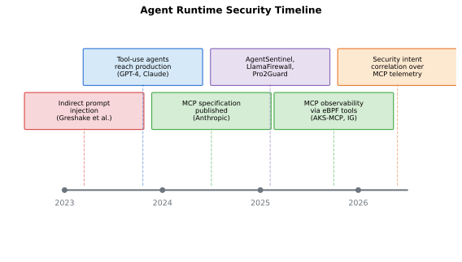
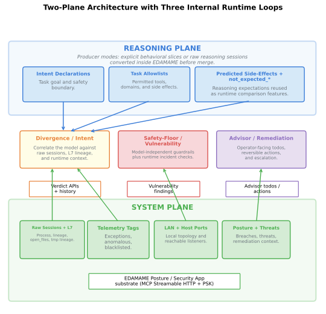
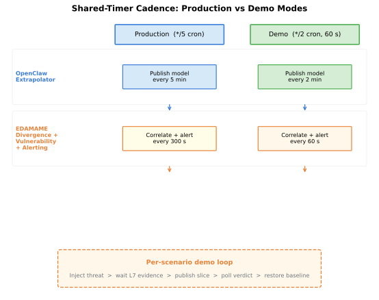
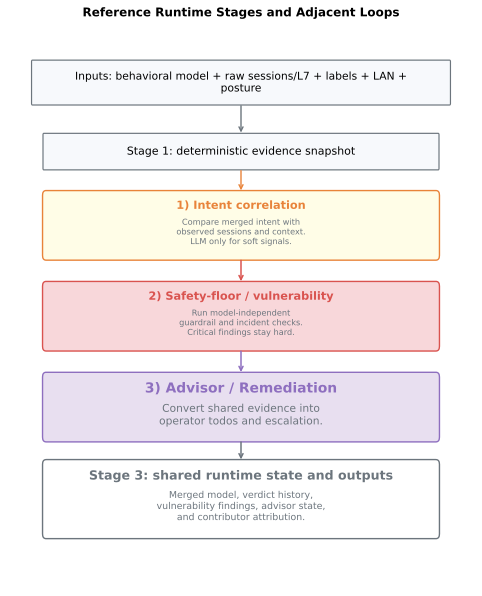
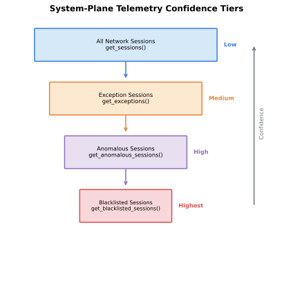
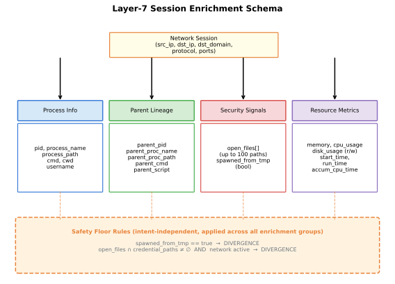
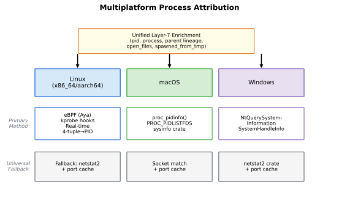
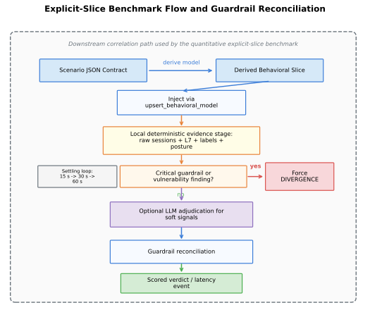

# Runtime Security for Agentic Systems

## A Practical Two-Plane Approach for OpenClaw-Class Agents

Authors: Frank Lyonnet, Antoine Clerget  
Status: arXiv draft (not submitted)  
Version: 2026-03-02  

## Abstract

Tool-using AI agents expose a runtime security gap: pre-install scanning and
configuration hardening are necessary, but they cannot fully characterize
behavior that emerges during execution (e.g., indirect prompt injection and
tool poisoning). We present a two-plane security model that correlates
reasoning-plane observations (independently read session transcripts) with
system-plane telemetry to detect intent-behavior divergence.

The contribution is architectural: process-attributed telemetry, task-scoped
intent declarations, and a confidence-stratified signal hierarchy form a
portable control loop across MCP-compatible stacks. In the reference
implementation, EDAMAME accepts agent-tagged behavioral-model slices from
multiple reasoning-plane producers, including OpenClaw and Cursor, merges them
into one observer-owned correlation window, and preserves contributor
attribution. To demonstrate feasibility and relevance, the live benchmark in
this draft uses an OpenClaw-derived scenario corpus and the explicit-slice
producer path (`upsert_behavioral_model`) to exercise EDAMAME's downstream
correlation logic, while the same EDAMAME control loop also supports raw-session
ingest (`upsert_behavioral_model_from_raw_sessions`) for Cursor on a developer
workstation.

On the current canonical BadAgentUse artifact lineage (50 live scenarios across six
benchmark categories, plus two integration-validated categories; 273 valid
runs across 12 seeds), precision is
0.862 (CI95: [0.815, 0.899]) and recall is 0.987 (CI95: [0.962, 0.996]). Median
detection latency is 45.8 s (p95: 53.6 s): fast enough to support many
operator responses, but still a meaningful pre-alert window and therefore the
primary limitation of a reactive design. These aggregate metrics are
cross-checked by layered model-to-verdict validation of the core engine and a
focused live validation ladder spanning clean, unexpected-egress, `/tmp`
lineage, and designed-miss behavior. We explicitly mark designed
blind spots: living-off-the-land behavior under allowed process/destination
pairs and timing-window evasion before telemetry arrives. This frames the model
as a practical correlation architecture with an explicit latency trade-off
versus interception-first systems such as AgentSentinel, while still providing
a portable and trace-auditable runtime detection path.

## Keywords

agent security, runtime monitoring, prompt injection, tool poisoning, Model
Context Protocol (MCP), intent-behavior correlation, telemetry, reproducibility

## 1. Introduction

Agent systems now perform high-impact operations through tools and MCP
integrations: network access, file mutation, credential-adjacent actions, and
persistent memory updates. Risk therefore depends on what the agent actually
does at runtime, not only on what is statically configured before runtime.

A recent publicly discussed incident involving Meta security leadership and an
OpenClaw deployment that reportedly executed unintended mailbox-deletion actions
illustrates the practical problem: loss of control can happen during normal
runtime, even in technically sophisticated environments. Our model targets that
runtime-loss-of-control phase by providing independent host-side observation and
divergence alerts. It does not replace authorization design or pre-action
approval gates; if broad destructive permissions are already granted,
prevention still depends on those controls.

We characterize the problem in terms of three **control strata** to avoid
terminology collision with our model's two planes:

1. **S1: Supply-chain controls** (e.g., signed artifacts, provenance/SBOM checks).
2. **S2: Configuration controls** (e.g., localhost MCP bind + PSK auth, role and
   tool scoping, sandboxing, policy hardening).
3. **S3: Runtime behavior controls** (e.g., a declared read-only task followed by
   undeclared egress, detected via intent-behavior consistency checks).

The residual runtime-only failures that remain after S1/S2 controls are what we
call the **S3 gap**.

Together, S1/S2 can stop many failures. For example, an internet-exposed
OpenClaw gateway
(SecurityScorecard STRIKE, 2026) is often prevented by correct bind/auth
configuration, which is fundamentally a configuration-control problem.
However, S1/S2 do not fully address runtime divergence: in CVE-2026-25253, a
browser token exfiltration path can execute during normal user interaction even
when baseline setup appears acceptable. Similar runtime-only gaps arise in
coding agents operating over production repositories, where unauthorized access
to git-managed secrets, SSH keys, or CI tokens can produce outsized impact.

This paper addresses the S3 gap with a two-plane model: compare what the
reasoning plane declares with what the system plane observes on the host (defined in
Section 3). The approach
highlights a structural opportunity for security tooling vendors (here, EDAMAME
Posture) and AI platform providers (here, OpenClaw and Cursor) to collaborate through
MCP: the security tool provides system-plane ground truth that no AI framework
includes natively, while the AI platform provides the runtime observation
surface (session transcripts, memory, tool invocation history) that no external
monitor can access alone. Neither plane is sufficient in isolation; the
two-plane correlation is the security primitive.
By design, this first-generation rule set has a blind spot for living-off-the-land
behavior when both process and destination are already authorized; we surface
that limitation explicitly in Sections 7 and 9.

### 1.1 Contributions (Novelty)

We separate contributions into a model part and an implementation/evaluation
part.

**Model contributions (Part I):**

- **Two-plane runtime security model.** A portable control loop for correlating
  observed agent behavior (reasoning plane, via session transcript observation) with
  independent host telemetry (system plane).
- **Model-level requirements.** Process-attributed telemetry and a signal
  hierarchy are presented as requirements of the model, not as product-specific
  implementation details.
- **MCP-native framing and portability.** We argue that MCP is not only an
  integration transport but a key enabler of framework-agnostic runtime
  verification.

**Implementation and evaluation contributions (Part II):**

- **OpenClaw + Cursor-capable EDAMAME instantiation.** A concrete deployment
  path over local, PSK-authenticated MCP with rollback-capable action handling
  and merged multi-agent reasoning-plane inputs. The quantitative benchmark in
  this draft uses OpenClaw-derived scenarios with explicit prebuilt-window
  behavioral-model slices published into EDAMAME, while Cursor is integrated
  through the raw-session observer contract rather than treated as a separate
  detection engine.
- **Trace-backed benchmark protocol.** Every verdict is tied to on-disk
  telemetry artifacts for auditability.
- **Empirical performance characterization.** Precision/recall, latency, and
  failure modes are measured on a live 50-scenario suite, including explicit
  designed-miss scenarios, and cross-checked with layered model-to-verdict
  validation.

## Part I — Two-Plane Model

Part I is organized as follows: Section 2 positions this work in prior runtime
security literature; Section 3 defines the two-plane model; Section 4 states
threat assumptions and boundaries; and Section 5 gives concise properties of
the decision rules as a bridge to implementation. Readers primarily interested
in model mechanics and applications may skip Section 2 and proceed directly to
Section 3.

## 2. Background and Related Work

### 2.1 Attack Surface

Indirect prompt injection blurs data and instructions in LLM-integrated
applications, enabling remote compromise via retrieved content (Greshake et al.,
2023). Benchmarks such as InjecAgent show tool-integrated agents remain
vulnerable to indirect prompt injection (Zhan et al., 2024).

MCP expands the attack surface by standardizing tool descriptors and invocations.
Attacks embedded in tool metadata (tool poisoning, descriptor mutation) achieve
attack success rates up to 72.8% on capable models (MCPTox; Luo et al., 2025).
Mitigations include descriptor signing, semantic vetting (Jamshidi et al., 2025),
and multi-stage neural detection pipelines achieving 96% accuracy on adversarial
prompts (MCP-Guard; Chen et al., 2025). MCP's own specification documents
authorization and security best practices, including confused deputy risks in
proxying designs (MCP Spec, 2025). MCP Security Bench provides a 2,000-instance,
12-attack-type evaluation suite for systematically measuring tool-level defenses
(Wang et al., 2025).

Goal drift -- an agent's tendency to deviate from original objectives over
extended execution -- is now measurable in controlled evaluations. Zhou et al.
(2025) show that all evaluated models exhibit some drift under autonomous
operation, even when strong scaffolding substantially reduces it.

### 2.2 Runtime Defense Landscape

The 2025-2026 research cycle has produced a rich landscape of runtime defense
systems. We organize them by their primary signal source.

**Reasoning-plane defenses** monitor the agent's internal state (prompts, chain
of thought, tool call sequences) to detect compromise:

- AgentArmor (Gao et al., 2025) treats runtime traces as program objects,
  constructs CFG/DFG/PDG views, and applies type-checking to trust-boundary
  flows. It reports 97% defense success (3% attack success) on AgentDojo with
  modest utility impact.
- LlamaFirewall (Meta, 2025) provides three production guardrails: PromptGuard 2
  (BERT-based jailbreak detection), Agent Alignment Checks (chain-of-thought
  auditing for prompt injection and goal misalignment), and CodeShield (online
  static analysis). It is deployed in production at Meta.
- AegisLLM (Li et al., 2025) uses cooperative multi-agent defense where
  orchestrator, deflector, responder, and evaluator agents collaborate for safe
  outputs, reporting a 51% improvement on jailbreak benchmarks without
  retraining.
- A2AS (Wallarm et al., 2025) proposes the BASIC security model: behavior
  certificates, authenticated prompts, security boundaries, in-context defenses,
  and codified policies. The initiative has broad industry sponsorship and is
  emerging as a framework-level governance model.

**Hybrid defenses** combine reasoning-state signals and runtime action signals:

- MI9 (Singh et al., 2025) is the first integrated runtime governance framework,
  combining goal-conditioned drift detection, FSM-based conformance engines,
  continuous authorization monitoring, and graduated containment. Reports 99.81%
  detection on synthetic scenarios.
- AgentSentinel (Hu et al., 2025) intercepts all sensitive operations within
  agent services, halting execution until a security audit correlating task
  context with system traces completes. Achieves 79.6% defense success across
  60 attack scenarios in 6 categories.
- Pro2Guard (Zhang et al., 2025) learns Discrete-Time Markov Chains (DTMCs) from
  execution traces and proactively predicts unsafe states before they occur, with
  PAC-style correctness bounds. Reported defense success is 97.4% (2.6% unsafe
  outcomes).

**Formal verification approaches** provide provable safety properties:

- ShieldAgent (Xu et al., 2025) constructs safety policies as verifiable rule
  circuits and generates shielding plans with executable code for formal
  verification. Achieves 90.1% recall on safety violations.
- Agent-C (Kamath et al., 2025) enforces temporal safety constraints via SMT solving and
  constrained generation, achieving 100% conformance on leading-model evaluations.
- VET (Li et al., 2025) establishes verifiable execution traces via trusted
  hardware, cryptographic proofs, and notarized TLS transcripts with practical
  overhead under 3x for API calls.
- AgentGuard (Koohestani, 2025) provides runtime verification via probabilistic model checking
  and Dynamic Probabilistic Assurance for quantitative agent properties.

**Chain-of-thought monitoring research** reveals important limitations:

- Models can generate benign-sounding CoT explanations that mask misaligned
  intentions, causing monitors to fail (Thought Crime; Rogers et al., 2025).
- Agent awareness of monitoring is the single strongest evasion advantage --
  detection rates drop sharply when agents know they are monitored (Baker et al.,
  2025).
- Hybrid protocols scoring both reasoning and actions consistently surpass
  either alone, with 2x higher detection for subtle deception scenarios (CoT
  Red-Handed; Goldowsky-Dill et al., 2025).

### 2.3 Positioning

Table 2 summarizes the landscape. Our system provides MCP-native,
multiplatform process-attributed telemetry integrated with intent correlation.
The closest comparator is AgentSentinel, which also correlates task context
with OS-level traces via eBPF/LSM. Key differentiators:

- **Multiplatform**: our observer (EDAMAME Posture) works across Linux, macOS,
  and Windows (Section 4.3), while AgentSentinel requires Linux eBPF/LSM.
  eBPF enhances attribution resolution on Linux but is not required.
- **MCP-native**: telemetry is exposed as standard MCP tools over Streamable
  HTTP with PSK authentication, usable by any MCP-compatible agent without
  custom integration.
- **Correlation vs. interception**: AgentSentinel halts execution at sensitive
  operations for synchronous audit; our system primarily correlates observed
  behavior after it appears in telemetry, with an optional proactive layer for
  MCP-gated actions. This trades immediate blocking for lower runtime friction
  and broader platform compatibility.
- **Latency trade-off (explicit).** Our measured 45.8 s median detection delay (p95: 53.6 s)
  is a practical limitation of reactive observation; AgentSentinel reduces this
  gap for intercepted operations but at the cost of inline interception and
  Linux/eBPF coupling.

Its primary limitations relative to the field are partial reasoning-plane
coverage (transcript-only, no CoT introspection; Section 9) and absence of
formal safety proofs.

\begingroup\small
\begin{center}
\setlength{\tabcolsep}{4pt}
\renewcommand{\arraystretch}{1.04}
\begin{tabular}{@{}>{\raggedright\arraybackslash}p{0.18\linewidth}>{\raggedright\arraybackslash}p{0.14\linewidth}>{\raggedright\arraybackslash}p{0.08\linewidth}>{\raggedright\arraybackslash}p{0.18\linewidth}>{\raggedright\arraybackslash}p{0.30\linewidth}@{}}
\toprule
System & Plane & MCP & Platforms & Eval. Scale \\
\midrule
AgentArmor & Reasoning & No & Any & AgentDojo (97\%) \\
LlamaFirewall & Reasoning & No & Any & Meta internal \\
AegisLLM & Reasoning & No & Any & Jailbreak bench. \\
A2AS BASIC & Reasoning & Yes & Any & Framework-level \\
MI9 & Hybrid & No & Any & Synthetic (99.81\%) \\
AgentSentinel & Hybrid & No & Linux (eBPF) & 60 scen., 6 cat. \\
Pro2Guard & Hybrid & No & Any & Household + AV \\
ShieldAgent & Formal & No & Any & Web environments \\
Agent-C & Formal & No & Any & Multiple bench. \\
VET & Trace & No & Any & Black-box API \\
MCP-Guard & Metadata & Yes & Any & 70,448 samples \\
\textbf{This work} & \textbf{Hybrid} & \textbf{Yes} & \textbf{Lin/Mac/Win} & \textbf{50 scen., 8 cat.} \\
\bottomrule
\end{tabular}
\end{center}
\endgroup

\begingroup\footnotesize\noindent A2AS BASIC is conceptual at the MCP-native layer. \texttt{This work} is hybrid because reasoning-plane sessions and system-plane telemetry are observed independently and merged only inside the observer-owned runtime.\par\endgroup

Formal properties reported by prior systems:
- A2AS (behavioral certificates)
- MI9 (FSM conformance)
- Pro2Guard (PAC-correctness)
- ShieldAgent (rule circuits)
- Agent-C (SMT temporal constraints)
- VET (cryptographic proof)
- MCP-Guard (neural detector, reported 96%)

Deployed systems in this survey scope:
- LlamaFirewall (Meta production)
- A2AS (emerging standard)
- This work (Lima VM)
- All others are currently research-only artifacts.



No prior published defense, to our knowledge, exposes continual,
process-attributed OS-level telemetry (eBPF sessions, parent process lineage,
open file paths) as MCP tools and then demonstrates intent-telemetry
correlation through that same interface.[^mcp-novelty-survey] Close neighbors
(AgentSentinel, LlamaFirewall, MCP-Guard) intercept or audit tool calls but do
not expose OS-level telemetry as a first-class MCP self-inspection surface.
The trade-off is that system-plane monitoring is inherently reactive
(Section 3.6) and reasoning-plane coverage is transcript-only, without
CoT introspection (Section 9).

### 2.4 Reflection as Relevant Prior Art

The model is also related to reflection-oriented programming, where a program
observes and reasons about its own behavior through a meta-level interface.
Sobel and Friedman (1996) frame reflection as separating base-level execution
from meta-level supervision. Our two-plane model adopts a similar separation:
the reasoning plane executes and declares intent; the system plane independently
observes effects and can challenge that declaration. We do not claim formal
equivalence to classic reflection systems, but the analogy is useful for
conceptual grounding.

[^mcp-novelty-survey]: Survey scope (as of February 2026): arXiv, ACM DL, IEEE Xplore, and USENIX
  proceedings through February 2026 using keywords including "agent runtime
  monitoring", "MCP security", "tool-use telemetry", and "eBPF agent", plus
  manual review of MCP specifications and ecosystem tooling.

## 3. Two-Plane Architecture (Reasoning Plane and System Plane)

- **Reasoning plane:** what the agent declares it is doing and why.
- **System plane:** what the host actually does.

At a high level, the control loop is:

declare intent ->  
  derive expected effects ->  
    observe host behavior ->  
      correlate ->  
        compute deterministic evidence ->  
          apply LLM adjudication with critical-signal guardrails ->  
            emit final divergence verdict



The architecture maps reasoning-plane intent declarations to system-plane
telemetry correlation, and emits divergence when observed behavior is not
explained by declared intent. In the deployed system, the behavioral model
consumed by the divergence engine can be a merged window assembled from
multiple agent-tagged contributors (for example OpenClaw plus Cursor) rather
than a single producer. Producer modes are additive: OpenClaw commonly uses the
prebuilt-window publication path, while workstation integrations such as Cursor
can forward raw reasoning sessions so EDAMAME generates the contributor slice
internally before merge.

The operational cadence is shared-timer-driven: extrapolator and divergence
verdict-reader jobs run on offset timers, while EDAMAME evaluates three
adjacent runtime loops internally. The timer structure is important to
portability: it avoids dependence on framework-specific synchronous hooks and
keeps behavior consistent across deployments. We considered two alternatives --
interception-first synchronous gating (lower delay but higher runtime friction
and tighter platform coupling) and a single merged polling loop (simpler but
weaker separation between model publication and verdict consumption). The
shared-timer split gave the best operator clarity while preserving
framework-agnostic deployment.

The paper's model claim remains two-plane correlation. The three-loop split is
an implementation decomposition of the system plane in the reference
instantiation:

1. **Divergence / intent loop.** Correlates the merged behavioral model against
   raw process-attributed telemetry and emits intent-relative evidence when
   observations are not explained by declared behavior.
2. **Vulnerability / safety-floor loop.** Evaluates model-independent guardrail
   findings and runtime incident checks (for example `/tmp` lineage,
   credential-file-plus-egress, exposed listeners, and other vulnerability
   detectors), including cases where the behavioral model is missing or stale.
3. **Advisor / remediation loop.** Groups posture, breach, LAN, and
   high-confidence telemetry findings into operator-facing todos and reversible
   actions.

This separation is deliberate: telemetry confidence labels such as
`anomalous` or `blacklisted` are useful operational signals, but they are not
treated as intent-relative divergence evidence by themselves. Scenarios are
judged from engine verdicts read via `get_divergence_verdict`; the final
operator verdict may be LLM-adjudicated, but deterministic safety-floor and
vulnerability-loop findings remain non-downgradable.





### 3.1 Reasoning-Plane Inputs

The reasoning plane provides structured declarations:

- intent statement (task-scoped)
- tool plan and rationale
- predicted side effects
- task-conditioned allowlists (processes/domains/paths)

**Session-transcript observation (reference implementation, Part II).** This
detail matters because it changes the trust model of the reasoning plane. In
the reference implementation, the reasoning plane is not self-declared. For
OpenClaw, a separate monitor session reads other sessions' tool calls and
reasoning via the platform's `sessions_list` and `sessions_history` APIs. For
Cursor, a parallel publisher emits the same behavioral-window schema with its
own `agent_type` and `agent_instance_id`. EDAMAME stores these slices,
preserves contributor attribution, and merges them before correlation. This
means an agent cannot retroactively edit or suppress evidence of its tool calls
when the transcript or observer surface is platform-controlled. The reasoning
plane therefore shifts from trust-dependent self-declaration to an
independently verifiable record, though transcript integrity still depends on
the platform (see Section 9, Limitations).

### 3.2 System-Plane Observations

The system plane consumes independent host telemetry:

- network sessions with **Layer-7 process enrichment** (binary, parent lineage,
  open files, command line, resource usage)
- telemetry confidence labels (`exceptions`, `anomalous`, `blacklisted`)
- host LAN visibility and local open-port observations
- posture score deltas and threat-model outputs

These telemetry labels are organized as a strict confidence hierarchy:

```text
sessions -> exceptions -> anomalous -> blacklisted
```



The hierarchy is part of the model as a system-plane evidence-prioritization
mechanism, not merely an EDAMAME implementation detail: it separates "did
anything happen?" from "how strongly should we trust that this is malicious?"
and allows conservative policy tuning at lower tiers. In the reference
implementation, however, those labels do not replace intent correlation. The
divergence / intent loop reasons primarily over raw sessions plus Layer-7, LAN,
and open-port context; the vulnerability / safety-floor loop and the advisor /
remediation loop consume `anomalous` and `blacklisted` labels as high-confidence
operational signals.

### 3.3 Why Process Attribution Is Model-Critical

The two-plane model requires process attribution to remain meaningful:

- without process attribution, an allowlist collapses to destination-only checks,
  so benign and malicious programs contacting the same endpoint become
  indistinguishable
- parent-process lineage is required to detect spawn-chain manipulation, where
  an approved binary is launched through an untrusted wrapper chain
- open-file context is required for credential-adjacent detection, because
  outbound traffic alone cannot show whether sensitive files were read just
  before egress

This requirement is independent of implementation. Any observer that cannot
attribute connections to concrete processes cannot fully realize the model.



Each session record is enriched with process identity, parent lineage, security
signals (including `open_files` and `spawned_from_tmp`), and resource metrics.
In this schema, safety-floor rules apply across the full evidence bundle, not
only to a single branch.

### 3.4 Why MCP Matters to the Model

MCP is not only a transport convenience. It makes the model operationally
portable:

1. **Structured semantics.** Typed responses reduce parsing ambiguity and let
   correlation logic consume machine-readable evidence directly.
2. **Transactional actions.** Execute/rollback patterns make pre-action and
   post-action checks composable.
3. **Framework portability.** MCP-facing tools can be consumed by OpenClaw,
   Cursor, other coding agents, and other MCP-compatible clients with minimal
   glue code. In the deployed contract, each producer tags its slice with
   agent identity and EDAMAME performs the merge centrally.

As positioned in Section 2.3, exposing continual process-attributed host
telemetry as first-class MCP tools is central to this instantiation.

### 3.5 Multiplatform Requirement and Instantiation

Multiplatform operation is not cosmetic. Agent workflows already span Linux
servers, macOS developer hosts, and Windows enterprise endpoints. This is
especially true for coding agents operating across local repos, CI runners, and
production deployment environments.

Accordingly, the model requires attribution beyond Linux-only eBPF paths.
Our current implementation uses:

- Linux eBPF where available
- native macOS/Windows process APIs
- a socket-matching fallback when kernel telemetry is unavailable



### 3.6 Observation Delay Is a Constraint, Not a Contribution

Telemetry is delayed relative to action execution. We therefore use a settling
schedule (e.g., 15 s -> 30 s -> 60 s) and stop when snapshots stabilize.
This is an operational accommodation, not a conceptual novelty claim.

### 3.7 Two Example Rules (Simple and Realistic)

We present two example rules: one intentionally simple and one more realistic.
The rules themselves are not claimed as contributions; they are concrete
examples of model use and an introduction to the rule properties discussed in
Section 5.

- **Example Rule A (simple, reactive):** intent-vs-observation correlation
  after telemetry arrives.
- **Example Rule B (more realistic, proactive+reactive):** pre-action blocking
  for MCP-gated operations plus Rule A for residual detection.

**Example Rule A: Reactive Intent-vs-Behavior Correlation**

```text
process_allowed = (evidence_process in allowed_processes)
domain_allowed  = (target_ip in allowed_domains)
explained       = process_allowed AND domain_allowed

guardrail_signal = (safety_floor_findings > 0)
                OR (vulnerability_findings > 0)

intent_mismatch  = (session_matches > 0 AND explained == false)
                OR (credential_access AND session_matches > 0)

divergence = guardrail_signal OR intent_mismatch
```

**Example Rule B: Pre-Action Guard Rule**

```text
action = proposed tool call (name, arguments)
intent = current declared intent

spawns_from_tmp     = action.working_dir starts_with /tmp/ | /var/tmp/ | /dev/shm/
targets_credentials = action.arguments reference sensitive file paths
targets_blacklisted = action.arguments contain known-blacklisted endpoints

process_in_allowlist = action.tool_binary in intent.allowed_processes
target_in_allowlist  = action.target_endpoint in intent.allowed_domains

static_violation = spawns_from_tmp OR targets_credentials OR targets_blacklisted
intent_violation = NOT (process_in_allowlist AND target_in_allowlist)

block = static_violation OR intent_violation
```

In this draft, "sensitive credential paths" is a configurable static set
(for example `~/.ssh/*`, kube configs, cloud credential stores, browser-token
stores, and CI token files) defined by deployment policy rather than inferred
at runtime.

Rule B does not replace Rule A: actions bypassing MCP still require reactive
system-plane correlation.



In this flow, sessions are checked against blacklists, vulnerability-detection
checks, and intent-conditioned allowlists within a settling-window loop.
Divergence is raised at the first failing check.

Model-level multi-signal scenarios (network + identity + LAN + posture) are
provided in Appendix A to keep the main narrative focused.

## 4. Threat Model, Assumptions, and Boundaries

We focus on runtime compromise modes that evade static checks:

- indirect prompt injection leading to unsafe tool use
- tool/MCP poisoning and capability misuse
- unexplained outbound communications during ostensibly read-only tasks
- credential-path and config-adjacent anomalies
- cross-session behavioral drift and memory poisoning

### 4.1 Assumptions and Why They Are Reasonable

**Assumptions**

- The observer is co-located with the runtime host.
- Baseline S1/S2 controls are not skipped.
- High-risk actions can require human confirmation when enabled.

**Rationale**

- Co-location is necessary for process attribution and parent-lineage fidelity.
- If S1/S2 are absent, runtime detection is overloaded with preventable risk.
- Human confirmation for destructive actions is standard in production ops.

**Out of scope (with rationale)**

- Formal properties under arbitrarily compromised reasoning planes (requires
  stronger mechanisms such as formal methods or trusted execution).
- Internet-scale adaptive adversarial campaigns (requires different evaluation
  infrastructure than the controlled benchmark used here).

### 4.2 Reasoning-Plane Integrity

The key question raised by reviewers is valid: if an attacker can control
intent declarations, can they simply declare harmful intent and pass
correlation? The answer depends on which failure case occurred:

- **Case A - Tool misuse within declared benign intent.** The model is strong.
  Divergence appears because observed behavior exceeds declared intent.
- **Case B - Correctly declared harmful intent.** Correlation alone is
  insufficient if policy allows that action. Additional governance controls
  (environment-aware allowlists, posture-delta thresholds, change-control
  invariants) are required.
- **Case C - Missing blast-radius guardrails.** If destructive production actions
  are broadly authorized, the root cause is authorization architecture, not
  telemetry correlation. The two-plane model complements S1/S2; it does not
  replace IAM scoping, segmentation, and approval workflows.

To raise attacker cost in Cases A/B, we apply two mitigations.

**Intent-independent critical signals.** The following triggers cannot be
downgraded by LLM adjudication or intent declarations:

1. blacklisted destination access
2. CVE-inspired vulnerability-detection failures (gateway binding, token exfiltration,
   skill supply chain, sandbox exploitation)

Model-correlated signals (unexplained sessions, credential access concurrent
with outbound traffic, anomalous network patterns) are promoted as divergence
evidence and adjudicated by the LLM. The LLM always makes the final verdict
decision, but critical signals act as non-downgradable guardrails.

**Intent-declaration anomaly tracking.** Motivation: compromised agents often
"prepare the ground" by gradually broadening intent language before executing
harmful actions. We therefore track:

1. allowlist budget expansion across redeclarations
2. abrupt intent-category shifts
3. redeclaration churn (rate spikes)

This signal is currently specified at the model level; its marginal contribution
is not isolated in the Section 7 confusion-matrix metrics.

These mitigations do not remove the trust boundary entirely, but they force an
attacker to simultaneously evade both declaration-level and system-level checks.

### 4.3 Observer Integrity and Evasion Boundaries

The model assumes a trustworthy observer process. Under kernel/root compromise,
the observer itself can be tampered with. Potential hardening paths include
watchdog heartbeat, cryptographic attestation, and stronger isolation.

Primary residual evasion classes are:

- **Living-off-the-land** (allowed process + allowed destination)
- **timing attacks** (harm before first informative snapshot)
- **observer evasion/tampering**
- **credential-less exfiltration** (transient file access not captured in time)

The most operationally important combined risk is living-off-the-land plus
timing. This combination is dangerous because behavior can remain syntactically
"allowed" while executing before the most informative telemetry fields are
available. Near-term mitigations are shorter enrichment intervals, sticky
process-context retention, stricter defaults for high-risk tasks, and proactive
Rule B gating for MCP-mediated operations. We detail mitigation priorities and
benchmark blind spots in Section 9.

### 4.4 State Isolation and Observer Independence

A subtle but critical attack surface in agentic frameworks is *shared mutable
state*. Many frameworks persist inter-session context -- behavioral models,
verdicts, operational memory -- in flat files within the agent's workspace
(e.g., `MEMORY.md`, `SOUL.md`). These files are readable and writable by any
process on the host. This creates multiple attack vectors:

1. **Model poisoning.** A compromised process writes false behavioral
   predictions into the shared memory file, causing the detection layer to
   whitelist malicious traffic patterns as "expected."
2. **Verdict tampering.** A compromised process overwrites the stored verdict
   (e.g., writing `CLEAN` over a `DIVERGENCE` determination), suppressing
   alerts before they reach human operators.
3. **Self-covering reasoning plane.** A compromised agent can edit its own
   memory to erase evidence of divergent behavior, defeating any retrospective
   audit.

These attacks are particularly dangerous because they require no privilege
escalation -- only filesystem write access to a user-owned directory.

Our architecture mitigates this by *internalizing detection state*. The
divergence engine runs inside the EDAMAME host runtime: the EDAMAME Posture
daemon in the reference benchmark deployment, and the EDAMAME Security app on
workstation-hosted Cursor paths. Behavioral models, verdict history, and
engine configuration live in process memory and are accessible only through
authenticated MCP endpoints (pre-shared key).
Multiple reasoning-plane producers can push agent-tagged slices via
`upsert_behavioral_model`; EDAMAME merges those slices into one observer-owned
correlation window while retaining contributor attribution metadata. The
reasoning-plane agent can contribute predictions, but cannot read or modify
verdicts, engine state, or critical-signal rules.

This separation provides three concrete assurances:

- **Unilateral tamper resistance.** Compromising the reasoning plane alone is
  insufficient to suppress detection. The observer's state is unreachable from
  the agent's process or filesystem.
- **Independent alerting.** The observer-owned notification pipeline (Slack,
  Telegram, webhook) is shared across agentic and divergence/vulnerability
  outputs, not owned by the agent. Even a fully compromised reasoning plane
  cannot intercept or cancel outbound alerts.
- **Critical-signal invariance.** Intent-independent rules (Section 4.2) are
  evaluated inside the observer. No external input can downgrade a
  critical-signal finding.

The extrapolator skill retains OpenClaw's memory system for its own
operational checkpoint (a cursor tracking the last-processed session). This
is acceptable: the checkpoint is not security state. Corrupting it causes the
extrapolator to reprocess sessions but cannot influence EDAMAME's verdicts.

## 5. Properties of the Decision Rules

This section can be read as a short extension of Section 4 (Threat Model): it
states properties of the deterministic decision rules (Example Rules A-B) that
hold by construction. These are not deep theorems; they are simple, auditable
invariants meant to make system behavior transparent. We explicitly distinguish
these from stronger formal properties (PAC bounds,
temporal SMT constraints, cryptographic proofs) provided by systems such as
Pro2Guard, Agent-C, and VET (Section 2.2). Our contribution is practical, not
formal.

### 5.1 Definitions

For each step t:

- I_t: declared intent (reasoning plane)
- C_t: context constraints derived from I_t (e.g., allowlists)
- O_t: system-plane observation snapshot after settling
- K(O_t): critical-signal predicate (true if blacklisted traffic or vulnerability-detection failure)
- E(I_t, C_t, O_t): "explained" predicate (true if O_t is consistent with intent)

The two-plane alert predicate is:

$$
D(I_t, C_t, O_t) = K(O_t) \lor (O_t \neq \emptyset \land \neg E(I_t, C_t, O_t))
$$

### 5.2 Property 1 (False-Positive Monotonicity)

For any anomaly predicate A over observations, let D_gated = A AND (NOT E) and
D_critical = K OR D_gated. Then for benign runs where K does not fire:

```text
P(D_critical = 1 | benign, K=0) = P(D_gated = 1 | benign) <= P(A = 1 | benign)
```

This follows from set inclusion: {D_gated=1} implies {A=1}. Intent-gating
cannot increase false positives relative to anomaly-only alerting when no
critical signal is triggered.

**Remark (critical-signal false positives).** Critical signals *can* produce
false positives for benign operations that coincidentally match (e.g., a
legitimate connection to a recently-blacklisted destination).

### 5.3 Property 2 (Settling Window and Miss Rate)

Let L be the time until an action's effects become observable. With maximum
wait W: P(miss) = P(L > W). Progressive re-checks (sampling at t1 < t2 < ... < W)
do not change this bound but reduce the expected detection latency when L < W.

### 5.4 Property 3 (Example Rule A Correctness Under Complete Telemetry)

Assume the evidence bundle is complete: `session_matches > 0` iff the endpoint
was contacted by `evidence_process` after the watermark. Example Rule A returns
`divergence=true` iff the observed egress is not authorized by intent OR a
critical signal fires. This follows directly from the algorithm's structure
and is not a claim about real-world completeness. In practice, this assumption
is violated by settling windows and refresh delays (Section 3.6, Section 9.1),
so Property 3 should be read as a rule-level sanity property, not an empirical
coverage claim.

### 5.5 Property 4 (Pre-Action Blocking is Conservative)

Example Rule B blocks on `static_violation OR intent_violation`. Since both
predicates are computed from the proposed action and current intent (no
telemetry), blocking is immediate (zero latency). The cost is over-blocking:
legitimate actions that happen to match a floor pattern (e.g., a build tool
that writes to `/tmp/`) require human confirmation.

### 5.6 Scope of These Properties

These properties characterize the decision rules under idealized assumptions
(complete telemetry, correct allowlists, honest intent for Property 1). They
do not provide:

- Safety properties under partial telemetry (missed sessions, eBPF gaps)
- Bounds on evasion probability (see Section 4.3)
- Temporal safety properties (no ordering constraints on actions)
- Probabilistic properties on detection rates (the Wilson CI in Section 7.4
  is empirical, not analytical)

Systems that require these stronger properties should consider Pro2Guard
(PAC bounds), Agent-C (temporal SMT), or VET (cryptographic attestation).

Part I takeaway: the model provides a portable and auditable way to correlate
declared intent with host-observed behavior, but by itself it does not provide
zero-latency interception, complete living-off-the-land coverage, or formal
safety proofs. Part II therefore focuses on implementation feasibility and
measured operational behavior.

## Part II — Implementation and Evaluation

Part II demonstrates feasibility and relevance: Section 6 describes our
implementation, Section 7 reports evaluation results, Section 8 documents
reproducibility assets, Section 9 states limitations and near-term work, and
Section 10 discusses ethics and safe use.

## 6. Implementation (OpenClaw + EDAMAME Posture)

Our implementation uses a shared-timer architecture with one OpenClaw reasoning
skill, EDAMAME-internal detection/remediation loops, and an internal EDAMAME
divergence engine:

**Two-Plane Detection (cooperating timer jobs):**

- `skill/edamame-extrapolator/` -- Reads raw session history via
  `sessions_list(activeMinutes=15)` and `sessions_history`, distills a compact
  behavioral model, and publishes it via `upsert_behavioral_model`. Runs every
  2-5 minutes. Uses per-session `message_count` checkpoints to implement a
  sliding window and avoid re-analysis.
- **Internal divergence engine** (inside EDAMAME Posture) -- Implements a
  hybrid Rust-deterministic + LLM-adjudication architecture. Runs every
  ~5 minutes by default (configurable). Each tick proceeds in three stages:
  1. **Deterministic evidence stage** (Rust, `divergence_engine.rs`): Stateless
     pure functions correlate behavioral model predictions against live telemetry
    (sessions, anomalous, blacklisted, exceptions) and run CVE-inspired
    vulnerability-detection checks (gateway binding via `ourselves.open_ports`, token
     exfiltration, skill supply chain, sandbox exploitation). Produces a baseline
     `DivergenceVerdict` with typed evidence (CRITICAL/HIGH/MEDIUM severity).
  2. **LLM adjudication stage**: The deterministic evidence bundle is submitted
     to the configured LLM provider for final verdict decision and operator-facing
     alert synthesis. The LLM receives the full evidence context and returns a
     structured `LlmDivergenceDecision` (verdict, confidence, reasoning) plus an
     optional `LlmHumanAlert` (title, body, severity).
3. **Guardrail reconciliation** (`reconcile_with_guardrails`): Critical signals
   -- vulnerability-detection findings and blacklisted-traffic evidence -- are
     non-downgradable. If the LLM attempts to override a CRITICAL deterministic
     finding, the guardrail forces DIVERGENCE with provenance
     `GUARDRAIL_FORCED_DETERMINISTIC`. Otherwise, the LLM verdict is accepted
     with provenance `LLM_CONFIRMED` or `LLM_OVERRULED_SOFT_SIGNALS`.
  Each verdict records full provenance: `deterministic_verdict`, `decision_source`,
  optional `llm_decision`, and optional `human_alert`. If the behavioral model is
  stale (>20 min), produces a STALE verdict. Verdicts are accessible via
  `get_divergence_verdict` MCP tool.

**Posture Management (EDAMAME-internal loop):**

- EDAMAME posture/remediation loop (internal) -- Reviews advisor todos and
  executes safe fixes through the native agentic pipeline. In OpenClaw,
  `skill/edamame-posture/` acts as a thin MCP facade for invoking these
  capabilities; scheduled remediation ownership remains inside EDAMAME.

**Supporting components:**

- OpenClaw plugin bridging to MCP: `extensions/edamame-mcp/`
- Live benchmark harness: `tests/benchmark/run_live_suite.py`
- Metric summarizer: `tests/benchmark/summarize_results.sh`
- Canonical claim binding: `docs/CLAIM_ARTIFACT_INDEX.md`

Behavioral-model and verdict state are internal to the EDAMAME divergence
engine. OpenClaw memory remains optional operational checkpointing for the
extrapolator cursor and is not authoritative detection state.

### 6.1 MCP Integration Path

EDAMAME Posture exposes a local, PSK-authenticated MCP endpoint via Streamable
HTTP (`http://127.0.0.1:3000/mcp`). OpenClaw calls EDAMAME MCP tools through a
local OpenClaw plugin (`extensions/edamame-mcp`) that implements a minimal HTTP
MCP client and exposes EDAMAME tools as native OpenClaw tools:

OpenClaw (native tool call) ->  
  `edamame-mcp` plugin ->  
    EDAMAME MCP (HTTP) ->  
      tool result

#### MCP Integration Notes

Section 3.4 explains why MCP is model-relevant. At implementation level, the
key point is that OpenClaw can consume EDAMAME as native tools (typed JSON over
local PSK-authenticated HTTP), so correlation logic can run without shell
parsing or privileged subprocess glue.

### 6.2 Trace-Backed Evidence Bundles

The live benchmark suite records:

- baseline and post-action telemetry snapshots
- inject logs with VM-side timestamps
- MCP call outputs (todos, action history)
- a run manifest with scenario set hash and git SHA

These artifacts enable independent inspection of every verdict.

### 6.3 Claim Gating and Validation Maturity Tiers

To avoid confusion between runtime **evidence bundles** (system telemetry used
by the divergence engine) and paper-level **validation status** (what this manuscript
has empirically established), we use the following maturity tiers:

- T0: implemented
- T1: demonstrated in integration tests
- T2: measured in trace-backed benchmark artifacts
- T3: independently replicated

Automation blocks unsupported strong-claim language unless minimum tier floors
are met. Published metric claims are anchored to a single manifest/summary
lineage in `docs/CLAIM_ARTIFACT_INDEX.md`, so run IDs, hashes, and benchmark
modes remain auditable.

### 6.4 Signal Coverage vs Validation Tier (What Is Empirically Supported)

The system targets multi-signal attacks, but empirical support is non-uniform.
Table 1 summarizes current status:

| Channel | Tier | Notes |
|---------|------|-------|
| Network egress (sessions, anomalous, blacklisted) | T2 | Trace-backed live suite (paper metrics) |
| Process lineage (parent\_pid, parent\_name, parent\_path) | T1 | Layer-7 enrichment integration-tested via MCP |
| Open file access (per-process file descriptors) | T1 | Credential-theft detection via open\_files |
| Exceptions / policy violations | T1 | Sanity-checked, no dedicated T2 protocol |
| MCP wiring (advisor\_get\_todos, action\_history) | T1 | OpenClaw -> plugin -> MCP path verified |
| Posture scoring (get\_score, advisor\_get\_todos) | T1 | Triage/demo flows; not yet T2-measured |
| Vulnerability detection (config/env safety scans) | T1 | Unsafe configuration plus host-open-port gateway exposure checks |
| Cross-session drift (memory poisoning) | T0/T1 | Partially exercised; not in T2 protocol |

### 6.5 Operational Context: Posture Scoring and Compliance

Beyond individual network signals, EDAMAME Posture continually computes a
composite security score (0-100) with subcategory breakdowns (network, system
integrity, system services, applications, credentials) and maps the endpoint
state against compliance frameworks (CIS Benchmark Level 1/2, ISO 27001/2,
SOC 2). This provides two advantages for the two-plane model:

1. **Baseline context.** Endpoint hardening level (e.g., 90/100 vs 45/100)
   changes risk posture and response aggressiveness.

2. **Score-delta detection.** A posture drop during a task (e.g., 65 to 50) is
   an independent system-plane signal, even when individual sessions look benign.

These capabilities are exercised in the extrapolator/internal divergence
engine flow and demo path (T1). Their incremental impact on T2 live detection
accuracy remains future work.
Even at current maturity, this context already improves operator triage and
supports safer action review in T1-validated workflows.

## 7. Evaluation: The BadAgentUse Benchmark

We introduce **BadAgentUse**, an open benchmark for evaluating agentic-system
monitors against real endpoint telemetry. Unlike prior benchmarks that simulate
network traces or rely on sandboxed environments, BadAgentUse injects live
traffic into a production-grade Linux VM and evaluates detection against
actual EDAMAME Posture session captures.

### 7.1 Setup
- **Environment:** Lima VM (`openclaw-security`), Ubuntu 24.04, 4 vCPU / 4 GiB
- **Observer:** EDAMAME Posture daemon (eBPF-backed on aarch64 Linux) with
  MCP Streamable HTTP endpoint on port 3000
- **Reasoning-plane path:** In production, OpenClaw publishes behavioral-model
  slices through the `edamame-extrapolator` skill, and Cursor publishes
  through the same EDAMAME contributor contract. For the quantitative
  BadAgentUse runs reported here, however, the harness injects
  scenario-specific behavioral-model slices directly via
  `upsert_behavioral_model` after deriving them from the scenario contract and
  live baseline telemetry. This isolates the downstream divergence engine from
  cron cadence and LLM nondeterminism. End-to-end extrapolator behavior is
  validated separately by integration and E2E tests rather than by the main
  aggregate metric loop.
- **Protocol:** 50 versioned JSON scenario files in `tests/benchmark/live-scenarios/`
- **Iterations:** configurable via `--iterations`; the current canonical artifact
  lineage is a partial live sweep rather than a uniform full grid
- **Seeds:** 12 distinct seeds in the current canonical live evidence set, with
  deterministic target-IP rotation
- **Trial unit:** one scenario evaluated per seed-iteration pair. The confusion
  matrix (Section 7.4) reports n=273 valid runs across 12 seeds, with 172
  skipped runs preserved in the readiness scorecard. Each iteration varies
  seeds and settling behavior; all iteration traces remain in artifacts.

#### Protocol Parameters

| Parameter | Value | Notes |
|---|---|---|
| Settling schedule | 15 s → 30 s → 60 s | Exponential back-off; max wait W = 60 s |
| Stability criterion | 2 consecutive stable snapshots | Snapshot = sessions + Layer-7 + posture unchanged |
| Layer-7 full refresh | 300 s (5 min) | Process metadata, parent lineage, open files |
| Sensitive-file scan | 30 s | Credential paths only; sticky retention |
| Anomaly-score threshold | 0 (any non-zero triggers) | Conservative; tunable per deployment |
| Posture-delta threshold | $\geq$ 1 point drop | Monitoring signal (not hard-gate) |
| Blacklist sources | FireHOL Level 1 + custom | Pinned at VM provision time |
| Allowlist semantics | Exact domain OR IP; no wildcards | AND logic: process AND destination must match |
| MCP endpoint | `127.0.0.1:3000`, PSK-authenticated | Localhost-only by default |
| LLM (attack detection) | `openai/gpt-5.1` | Deterministic tiers do not use LLM; compatible Azure-hosted OpenAI Responses models are supported as alternate providers |

### 7.2 Scenario Design (Versioned Categories)

In BadAgentUse, a **scenario** is a versioned JSON test contract that specifies:
(1) declared intent context, (2) injected runtime action or traffic pattern,
(3) expected enforcement label (`DIVERGENCE`, `CLEAN`, or `DESIGNED_MISS`), and
(4) the telemetry checks needed for scoring.

BadAgentUse covers eight categories spanning five signal families:

| Cat. | N | Signal | Description |
|------|---|--------|-------------|
| A. Network-Intent | 17 | Network | Undeclared egress, partial-allowlist AND, lateral movement |
| B. Process Lineage | 6 | Layer-7 | /tmp/ scripts, interpreter wrap, nested chains |
| C. Credential Theft | 7 | Layer-7 files | SSH, kube, gnupg, browser cookies, combined exfil |
| D. CVE Vulnerability Detection | 6 | Layer-7+allow | gateway\_binding / token\_exfil / credential overrides |
| E. Posture & Policy | -- | Posture | Score, policy, threats, HIBP (integration checks)† |
| F. LAN Awareness | -- | LAN | Device discovery, scan, anomaly APIs (integration checks)† |
| G. Adversarial | 8 | Mixed | LotL, timing, burst, path substitution |
| H. Noisy Benign | 6 | Network | Clean traffic, DNS, NTP, auto-update |

† Categories E and F are validated via dedicated integration scripts (Section 7.7),
not as JSON benchmark scenarios. The 50 benchmark scenarios span categories A--D, G, H.

**Enforcement labels.** Each scenario carries an `expected_enforcement` field:
`DIVERGENCE` (39 scenarios), `CLEAN` (8 scenarios), or `DESIGNED_MISS` (3
scenarios). The `DESIGNED_MISS` label explicitly marks living-off-the-land
attacks that Example Rule A cannot detect by construction (Section 4.3).

### 7.3 Metrics

We adopt the metric framework from AgentSentinel [Hu et al., 2025]:

- **DSR** (Detection Success Rate) = TP / (TP + FN) -- equivalent to recall
  for attack scenarios
- **FPR** (False Positive Rate) = FP / (FP + TN) -- rate of benign traffic
  incorrectly flagged
- **FNR** (False Negative Rate) = FN / (FN + TP) -- attacks that evaded detection
- **ASR** (Attacker Success Rate) = FNR -- attacks that succeeded despite monitoring
- **FT** (False Trigger) = FPR -- identical to FPR for symmetry
- **TTD** (Time-to-Detect) = median and p95 detection latency (ms), computed
  from injection timestamp to first evidence capture
- **Wilson CI95** on DSR and FPR for statistical significance

All metrics are computed from trace-backed NDJSON results by
`summarize_results.sh`, which also produces per-category and per-seed
breakdowns for stability analysis.

### 7.4 Statistical Confidence Reporting (Wilson Interval)

To bound measured proportions (precision/recall), we use the Wilson score
interval (Wilson, 1927). For `k` successes out of `n` trials and `z=1.96`
(95% confidence):

```text
p_hat = k/n
den   = 1 + z^2/n
center= (p_hat + z^2/(2n)) / den
half  = z * sqrt(p_hat*(1-p_hat)/n + z^2/(4n^2)) / den
CI95  = [center - half, center + half]
```

In our current canonical live evidence set:

| | Predicted DIVERGENCE | Predicted CLEAN |
|---|---|---|
| **Ground-truth attack** | TP = 225 | FN = 3 |
| **Ground-truth benign** | FP = 36 | TN = 9 |

Precision = 225/261 = 0.862 and recall = 225/228 = 0.987, yielding CI95
[0.815, 0.899] and [0.962, 0.996], respectively (n = 273 valid runs, 12 seeds).

The 3 FN are highly concentrated in two stress buckets: 2 occur in
adversarial-evasion behavior, with the remaining miss in intent-proof-floor
timing. Likewise, 22 of the 36 FP arise from noisy-benign traffic, with the
remaining 14 in the broader network-intent-correlation bucket. The
aggregate result therefore reflects localized boundary conditions rather than
uniform degradation across categories, and points directly to two remaining
needs: stronger benign-traffic baselining and better coverage of
living-off-the-land behavior.

### 7.5 Results

#### Current Canonical Live Evidence Set

*Results below come from the canonical evidence set in
`artifacts/live-paper-summary.json` (50 planned scenarios; 273 valid runs
across 12 seeds, with 172 skipped runs retained in the readiness scorecard).
These aggregate metrics are from the OpenClaw-derived live
benchmark population under the explicit-slice producer mode
(`upsert_behavioral_model`) into EDAMAME; Cursor uses the raw-session producer
mode (`upsert_behavioral_model_from_raw_sessions`) but is not a separate
benchmark cohort in this draft.*

**Claim-binding metadata (canonical evidence lineage):**

- `run_id`: `run-live-20260304T234441Z-live`
- `git_sha`: `473465c`
- `scenario_set_version`: `22cb4a6cbddf88154435207c279143f7245de94dbc47c5803ca349eb10f3de1d`
- `mode`: `live`
- `benchmark_mode`: `live`

<!-- AUTO_METRICS_START -->
| Metric | Value |
|---|---|
| Total runs | 273 |
| Precision | 0.8620689655172413 |
| Recall | 0.9868421052631579 |
| Precision CI95 | [0.8149560047336936, 0.898678107127887] |
| Recall CI95 | [0.9620350252457207, 0.9955153022192381] |
| Median latency (ms) | 45810 |
| p95 latency (ms) | 53582 |
| Rollback reliability | 1 |
| Stability (recall stddev) | 0.07229988054812211 |
<!-- AUTO_METRICS_END -->

**Readiness note.** The current committed lineage remains below the repo's
publication gate: `artifacts/arxiv-readiness-scorecard.json` is still `NO_GO`
because the precision CI95 lower bound is 0.815 and the skipped-run ratio is
38.7%. We keep these values in the draft because they are the currently
reproducible canonical artifacts on this branch.

#### Per-Category Detection

| Category | Run N | DSR | FPR | Notes |
|----------|-------|-----|-----|-------|
| Network intent correlation | 68 | 1.000 | 0.700 | undeclared egress is covered well, but benign allowance ambiguity still produces many false triggers |
| Process lineage verification | 45 | 1.000 | -- | spawned\_from\_tmp, wrapper lineage, nested chains |
| Credential theft detection | 36 | 1.000 | -- | SSH, kube, gnupg, browser-cookie access patterns |
| Credential-network combined | 7 | 1.000 | -- | combined credential + egress behavior |
| Intent-proof floor | 37 | 0.973 | -- | one remaining miss in floor-policy timing |
| Lateral movement | 1 | 1.000 | -- | nc-based lateral-probe preparation behavior |
| Adversarial evasion | 54 | 0.963 | -- | most cases detect; two LotL/timing misses remain |
| Noisy benign | 25 | -- | 0.880 | dominant benign false-positive source in the current live set |

Categories E (Posture & Policy) and F (LAN Awareness) are validated via
integration scripts with 100% pass rate (Section 7.7).

#### Analysis

**Observed false negatives (3).** Most misses occur in the
adversarial-evasion bucket (2 of 3), with one remaining miss in
intent-proof-floor timing. That concentration is more informative than the raw
count: the system remains strong on process-lineage, credential-access,
combined credential-egress, lateral-movement, and core network-intent
categories, while the residual miss surface is localized to living-off-the-land
executions that preserve expected binaries/destinations and to cases where
Layer-7 context arrives after the initial decision window.

**Layer-7 timing sensitivity.** The residual intent-proof-floor miss still
looks like an observability-boundary issue rather than a rule-construction
failure. When the 5-minute Layer-7 full-refresh cycle has not yet captured
process-lineage context at snapshot time, the first decision can be too early;
once enrichment lands, the same underlying logic succeeds.

**Operational false positives (benign ambiguity).** False positives are still
localized rather than uniform: 22 of the 36 FP arise in the noisy-benign
bucket (`FPR=0.880`, 22/25 runs), with the remaining 14 in the broader
network-intent-correlation category. This suggests that the current burden is
split between background traffic and benign-but-under-specified allowlist
contexts rather than generalized instability across all categories. In
deployment, that still matters:
persistent benign alerts erode operator trust quickly, so environment-specific
allowlisting or baseline learning is needed before policy hardening.

High-level takeaway: the current 12-seed live evidence set reinforces the
system's value as a runtime correlation layer for lineage, credential access,
lateral movement, and undeclared egress, while sharpening two caveats. First,
benign background traffic still needs better baseline treatment to avoid
operator fatigue. Second, adversarial/LotL behavior that stays within expected
tools or appears before Layer-7 enrichment remains difficult. The system is
therefore best understood as a practical early-warning layer, not as an
interception-grade prevention mechanism.

### 7.6 Ablation Studies

To interpret the overall Section 7.5 result, we run ablations that isolate
which components produce most of the detection lift and where misses originate.
The benchmark runner supports three ablation modes via `--ablation`:

| Ablation | Disabled | Expected Impact |
|----------|----------|-----------------|
| no-introspection (ablation flag name) | CVE vulnerability detection | Cat. D degrades to CLEAN |
| no-l7 | Layer-7 enrichment | Cat. B, C lose detection |
| no-settling | Settling window | Transient misses; timing evasion |

These ablations define component contributions. Running each mode writes
comparative summaries to `artifacts/live-paper-summary.json` for the benchmark-summary
visualization used in companion materials. In
this draft, full `no-floor` / `no-l7` / `no-settling` comparative tables are
not yet included in the canonical confusion-matrix snapshot.

**eBPF vs netstat2 fallback.** `tests/test_l7_ebpf_ablation.sh` runs the same
Layer-7 checks twice: with eBPF kprobes (default on kernels $\geq$ 5.8), then
with tracefs unmounted to force netstat2 `/proc/net/*` fallback.

| Mode | Checks | Pass | Layer-7 Latency | Sessions |
|------|--------|------|------------|----------|
| eBPF (kprobe) | 9 | 9/9 | 15 s | 50 |
| netstat2 (fallback) | 9 | 9/9 | 45 s | 31 |

Both modes pass 9/9 and produce the same enrichment fields (`pid`,
`process_name`, parent lineage including `parent_script_path`,
`spawned_from_tmp`, `open_files`, cwd, memory, cpu_usage). Latency differs
(15 s with eBPF vs 45 s fallback) because eBPF only accelerates socket-to-PID
mapping. After PID resolution, both paths share the same `/proc` enrichment
logic. Fallback can miss very short-lived sockets between polls, but for
connections that survive at least one poll cycle, detection capability is
preserved.

### 7.7 Multi-Signal Observer Validation

After isolating component-level effects, we verify observer breadth: the system
plane is not only a network monitor, but a multi-signal telemetry surface.
Categories E (Posture) and F (LAN) validate that the system-plane observer
extends beyond network sessions. The test suite verifies MCP tool
accessibility for five signal families:

1. **Network sessions:** `get_sessions`, `get_exceptions` (Categories A-D, G-H)
2. **Anomaly/blacklist:** `get_anomalous_sessions`, `get_blacklisted_sessions`
3. **Posture:** `get_score`, `check_policy`, `advisor_get_todos` (Category E)
4. **LAN:** `get_lan_devices`, `get_lan_host_device`, `set_lan_auto_scan` (Category F)
5. **Identity:** `get_pwned_emails`, `get_breaches` (Category E)

For benchmark/tool-access validation, the suite calls `get_sessions`; the
internal divergence and vulnerability loops themselves consume
`get_current_sessions` within the EDAMAME host runtime.

All five families are exercised deterministically (no LLM) with 100% pass
rates, confirming that the two-plane correlation loop can incorporate signals
from any of these dimensions without infrastructure changes.

### 7.8 Empirical Validation: Four-Tier Test Architecture

Beyond the benchmark suite, we maintain a four-tier test architecture:

**Tier 0: Smoke and component validation** (`smoke.sh`, `test_skill_components.sh`,
`test_extrapolator_validation.sh`, `test_posture.sh`). Deterministic checks
for daemon health, MCP tool visibility, session APIs, behavioral model engine
handoff, posture skill runtime. 79+ checks across 4 test groups, all passing.

**Tier 1: Layer-7 telemetry validation** (`test_l7_telemetry.sh`,
`test_l7_ebpf_ablation.sh`). Deterministic checks for parent lineage,
open-files detection, field correctness, and coverage (20 checks plus 2x9
eBPF/fallback checks).

**Tier 2: Attack and policy/LAN detection**
(`test_attack_detection.sh`, `test_posture_policy.sh`,
`test_lan_awareness.sh`). Engine-driven scenarios use the hybrid
Rust-deterministic + LLM-adjudication pipeline for attack detection, alongside
deterministic policy and LAN checks to validate posture/todos and
LAN/anomaly/blacklist/HIBP APIs.

**Tier 3: Two-plane E2E and vulnerability detection** (`test_two_plane_e2e.sh`,
`test_vulnerability_detection.sh`). Full worker + extrapolator + inject + detector
pipeline validation plus CVE-inspired vulnerability-detection checks across token
exfiltration, exposed gateways, weaponized skills, sandbox escapes,
credential sprawl, and memory poisoning.

\begingroup\footnotesize
\begin{center}
\setlength{\tabcolsep}{4pt}
\renewcommand{\arraystretch}{1.08}
\begin{tabular}{@{}>{\raggedright\arraybackslash}p{0.05\linewidth}>{\raggedright\arraybackslash}p{0.24\linewidth}>{\raggedright\arraybackslash}p{0.07\linewidth}>{\raggedright\arraybackslash}p{0.08\linewidth}>{\raggedright\arraybackslash}p{0.17\linewidth}>{\raggedright\arraybackslash}p{0.27\linewidth}@{}}
\toprule
Tier & Script & Checks & LLM? & Pass Rate & Notes \\
\midrule
0 & \texttt{test\_poc.sh} & 29 & Mixed & 97\% (28/28 + 1 skip) & Infrastructure, telemetry, MCP tools, agent \\
0 & \texttt{smoke.sh} & 14 & No & 100\% & Daemon health, eBPF kprobes \\
0 & \shortstack[l]{\texttt{test\_skill\_}\\\texttt{components.sh}} & 55 & No & 100\% & MCP tools, engine handoff \\
0 & \shortstack[l]{\texttt{test\_extrapolator\_}\\\texttt{validation.sh}} & -- & Yes & 100\% & Behavioral model pipeline \\
0 & \texttt{test\_posture.sh} & 24 & Yes & 100\% & Skill runtime invocation \\
1 & \shortstack[l]{\texttt{test\_l7\_}\\\texttt{telemetry.sh}} & 20 & No & 100\%* & PID, process name, cmd attribution \\
1 & \shortstack[l]{\texttt{test\_l7\_ebpf\_}\\\texttt{ablation.sh}} & 2x9 & No & Partial & eBPF vs fallback comparison \\
2 & \shortstack[l]{\texttt{test\_attack\_}\\\texttt{detection.sh}} & 22 & Mixed & Partial** & Engine verdict pipeline under stabilization \\
2 & \shortstack[l]{\texttt{test\_posture\_}\\\texttt{policy.sh}} & 8 & No & 87\% & 7/8 pass \\
2 & \shortstack[l]{\texttt{test\_lan\_}\\\texttt{awareness.sh}} & 6 & No & 83\% & 5/6 pass \\
3 & \shortstack[l]{\texttt{test\_two\_plane\_}\\\texttt{e2e.sh}} & -- & Yes & Partial** & Worker + extrapolator + detector pipeline \\
3 & \shortstack[l]{\texttt{test\_vulnerability\_}\\\texttt{detection.sh}} & 66 & Yes & 86\% & 57/66 pass \\
\bottomrule
\end{tabular}
\end{center}
\endgroup

\*L7 Tier 1: Basic L7 attribution (PID, process_name, full command line) passes
consistently with eBPF kprobe programs active (`track_connect_v4/v6`,
`trace_udp_send`, `trace_sendto`). Extended enrichment fields
(parent_process_path, open_files) are populated asynchronously by the L7
enricher and depend on `/proc` scan depth; these fields are not tested in the
core validation suite since they are additive context for the divergence engine
rather than structural correctness requirements.

\*\*Engine verdict: The hybrid Rust/LLM divergence engine returns structured
verdicts only after a behavioral model has been ingested and the 60-second
settling window has elapsed. The `test_poc.sh` suite correctly handles this as a
SKIP condition when no agentic tick has occurred. Tier 0 component tests (55/55)
confirm all engine MCP tools are reachable.

### 7.9 Discussion

**Latency is telemetry settling, not model delay.** The observed 40-60s TTD is
dominated by EDAMAME session aggregation and Layer-7 refresh cadence. Without
settling-window checks (Section 3.6), many runs would be scored on stale data.

**Process attribution is load-bearing.** Attack and benign runs can generate
identical traffic to the same endpoint; only process attribution separates
`curl` from `python3` at the same IP. Without Layer-7 enrichment, separation
collapses.

**Claim discipline is mandatory.** We do not claim comprehensive coverage.
BadAgentUse
validates five signal families and explicitly labels three designed blind
spots. The suite is extensible via new JSON scenarios, without code changes.

**Operational burden of benign noise.** The noisy-benign slice currently shows
`FPR=0.40` (2/5). This is acceptable for controlled benchmarking but high for
always-on production operations; reducing benign-noise alerts is a deployment
priority alongside improving attack recall.

**Comparative baselines are currently absent.** BadAgentUse does not yet include
head-to-head comparisons against AgentSentinel, AgentArmor, LlamaFirewall,
Pro2Guard, or Agent-C. This benchmark validates internal correctness of the
correlation protocol and telemetry surface, not superiority. Direct comparison
requires adapting either the harness for interception-style monitors or those
systems for MCP telemetry (Section 9.2).

## 8. Reproducibility

All source code, scenario definitions, test scripts, and evaluation harnesses
are published at:
**https://github.com/edamametechnologies/openclaw_security**

Key artifact paths:

- `tests/benchmark/live-scenarios/`: versioned JSON scenario contracts for live runs
- `tests/benchmark/run_live_suite.py`: benchmark harness
- `tests/benchmark/summarize_results.sh`: metric computation from NDJSON traces
- `reproduce_live.sh`: single-command full reproduction
- `artifacts/`: generated results (summary JSON, NDJSON traces, paper bundle)
- `artifacts/exec-demo-pack-<timestamp>/`: latest 4-scenario executive demo artifact pack (MP4 + verification contracts)
- `docs/CLAIM_ARTIFACT_INDEX.md`: canonical claim-to-artifact lineage binding

Single-command reproduction for paper metrics:

```bash
./reproduce_live.sh
```

This generates:

- `artifacts/live-paper-results.ndjson`
- `artifacts/live-paper-summary.json`
- `artifacts/live-paper-manifest.json`
- `artifacts/paper-bundle-live/*` (generated whitepaper bundle with embedded metrics)

## 9. Limitations and Future Work

### 9.1 Current Limitations

1. **Living-off-the-land blind spot.** The primary residual risk is LotL
   behavior (Section 4.3): allowed processes exfiltrating to allowed
   destinations. BadAgentUse explicitly labels 3 of 50 scenarios as
   `DESIGNED_MISS` for this reason. Closing this gap requires behavioral
   baselines, anomaly fusion, or payload-aware inspection.
2. **Layer-7 refresh latency.** Full Layer-7 enrichment refresh runs every
   5 minutes (sensitive-file scan every 30 s on Linux). Correlation rules that
   rely on `spawned_from_tmp` or `open_files` can miss short-lived processes if
   snapshots are stale. The `no-settling` ablation (Section 7.6) quantifies this.
3. **Reactive detection delay (operationally significant).** Example Rule A is
   post-observation and therefore delayed (median 45.8 s). In high-consequence
   environments, this window may still allow harmful actions before alerting.
   Example Rule B reduces this for MCP-gated actions, but direct shell/library
   paths can bypass pre-action checks.
4. **Interception trade-off vs AgentSentinel.** AgentSentinel reduces timing
   exposure for intercepted operations by pausing execution inline; our approach
   prioritizes portability and lower integration friction. This is a real
   design trade-off, not a superiority claim.
5. **Governance boundary (Cases B/C).** If the reasoning plane truthfully declares a
   harmful action and policy allows it, correlation alone is insufficient
   (Section 4.2). Authorization architecture, change control, and approvals
   remain mandatory.
6. **Reasoning-plane observation (partially addressed).** The
   extrapolator reads session transcripts via platform APIs, providing
   independent observation of tool calls and arguments. However, this is
   transcript-only -- chain-of-thought reasoning, internal model state, and
   unlogged deliberation are not observable. A sufficiently sophisticated
   attacker could craft tool calls that appear benign in the transcript while
   achieving malicious outcomes through side effects invisible to the session
   record.
7. **Observer integrity boundary.** Section 4.3 assumes a trustworthy observer.
   Under kernel-level compromise, telemetry can be suppressed or forged.
8. **Single-platform benchmark.** BadAgentUse is currently Linux-only (aarch64
   Lima VM). Multiplatform support exists in the observer but is not yet fully
   benchmarked in this protocol.
9. **Single-observer, non-federated focus.** The current EDAMAME runtime already
   supports multiple reasoning-plane contributors on one observer-hosted engine
   (for example OpenClaw plus Cursor slices merged into one correlation
   window), but multi-host delegation still requires federated observation and
   cross-host correlation that are not yet implemented.
10. **No formal safety proofs.** Section 5 provides transparent rule
    properties, not PAC bounds or cryptographic proofs.
11. **High-impact coding-agent scenarios remain under-tested.** We have not yet
    fully benchmarked destructive git workflows and secret-exposure paths
    (e.g., accidental commit/exfiltration of repository credentials and CI
    tokens), where delayed detection may be especially costly.
12. **External validation gap.** Independent replication remains necessary for
    claims beyond controlled-environment demonstration.

Benchmark-scope note: the aggregate metrics in Section 7 quantify EDAMAME's
downstream divergence/correlation performance under the explicit-slice producer
mode and do not directly measure transcript-to-model accuracy of either the
OpenClaw `edamame-extrapolator` skill or EDAMAME's internal raw-session ingest
path. End-to-end reasoning-plane publication is validated separately by the
integration and E2E paths described in Section 7.7.

### 9.2 Near-Term Work

- **Comparative evaluation on shared benchmarks**: run BadAgentUse scenarios
  against AgentSentinel, LlamaFirewall, and other monitors to produce
  head-to-head DSR/FPR comparisons. Requires adapting either the benchmark
  harness or the competing systems to a common telemetry interface.
- **Compound multi-stage attacks**: scenarios where a single compromised action
  chain touches all five signal dimensions (network, Layer-7, posture, LAN, identity),
  validating cross-dimension divergence detection in a single evaluation.
- **Adaptive evaluation**: extend BadAgentUse with scenarios that adapt their
  evasion strategy based on the monitor's known detection capabilities, following
  AgentSentinel's adaptive attack framework.
- **Reasoning-plane auditing**: add a lightweight CoT consistency check as a
  complementary signal. Before accepting an intent declaration, evaluate whether
  it is consistent with the conversation context and previous declarations.
- **Payload-aware detection**: extend Example Rule A to consider data volume and
  connection duration as additional signals for LotL detection.
- **MCP-native poisoning scenarios**: extend BadAgentUse with scenario families
  inspired by MCPTox (tool-description poisoning) and MSB (tool-response
  injection). The two-plane approach should detect policy-inconsistent egress
  or file access induced by such attacks even when the MCP call itself
  appears legitimate, but this requires empirical validation.
- **Observer-agnostic interface**: define an abstraction layer so that
  alternative telemetry providers (osquery, raw eBPF, Sysmon) can replace
  EDAMAME Posture, enabling independent replication and reducing the
  single-vendor dependency.
- **Ablation baselines**: implement a telemetry-only baseline (B0: blacklist +
  anomaly score only, no intent gating) and an allowlist-only baseline (B1: no
  critical signals) to quantify the contribution of intent correlation beyond
  existing observer signals.
- Measure rollback reliability under reversible action protocols.
- Multi-host replication with federated observers.
- Cross-platform benchmark runs on macOS and Windows (EDAMAME Posture supports
  both platforms; the benchmark harness requires adaptation).

## 10. Ethics and Safe Use

This system provides defensive runtime monitoring; it does not grant
authorization decisions or replace IAM/policy controls. It should be deployed
alongside baseline hardening controls (S1 and S2), manual confirmation paths
for high-impact actions, and claim discipline tied to measured evidence and
protocol scope.

### 10.1 Telemetry Privacy and Data Sovereignty

EDAMAME Posture follows a **privacy-first, user-up** architecture: all
telemetry is collected, processed, and stored locally on the endpoint. Session
data, Layer-7 enrichment, and posture snapshots are retained for a rolling 8-hour
window and then discarded. No telemetry -- including process metadata, open
file paths, command lines, or network sessions -- is ever transmitted to the
EDAMAME backend or any external service. The EDAMAME platform
(https://edamame.tech) is designed so that endpoint security operates in a
user/agent-up model where the user or agent owns and controls their own
security posture; no administrator can look down into endpoints or collect
personally identifiable information (PII). This stands in contrast to
traditional enterprise EDR/MDM architectures where a central admin has full
visibility into endpoint activity.

In multi-user or shared-host deployments, Layer-7 enrichment may include usernames
and command-line arguments, creating a local privacy surface. The MCP endpoint
defaults to localhost binding with PSK authentication (Section 10.2),
ensuring telemetry is not exposed beyond the local host.

### 10.2 MCP Endpoint Exposure

The Streamable HTTP MCP endpoint defaults to localhost binding (127.0.0.1:3000).
Misconfiguration -- binding to 0.0.0.0 or routing through a reverse proxy
without authentication -- would expose sensitive runtime telemetry to the
network. EDAMAME Posture supports pre-shared key (PSK) authentication; we
recommend enabling it whenever the endpoint is reachable beyond loopback. The
observer process itself is part of the attack surface (Section 4.3): an
adversary who compromises the MCP endpoint can suppress alerts or inject false
telemetry. Deployment hardening should follow the MCP specification's transport
security guidelines.

### 10.3 Ethical Considerations (Menlo Report Alignment)

We map our research to the Menlo Report's four ICT research ethics principles:

- **Respect for Persons.** No human subjects or real-user data are involved.
  All evaluation runs in an isolated Lima VM with synthetic injections. No PII
  is collected, stored, or transmitted. The 8-hour local retention window
  (Section 10.1) ensures no persistent personal data accumulates.
- **Beneficence.** The system is purely defensive. We document blind spots
  (LotL evasion, Section 4.3) and design limitations to prevent false
  confidence.
- **Justice.** Benchmark scenarios, decision rules, and evaluation scripts are
  open-source for independent replication and critique.
- **Respect for Law and Public Interest.** Telemetry collection occurs only on
  the researcher's own VM. No third-party systems are probed or scanned.
  Benchmark injections target localhost or controlled endpoints only.

### 10.4 AI Tools Disclosure

Generative AI tools (Claude, Cursor AI) assisted with code scaffolding and
paper editing. All outputs were reviewed and validated by the human authors.
No AI system is listed as an author. Scenario definitions, decision rules,
and architecture diagrams are human-authored. LLM-driven test tiers
(Categories A--C) use `openai/gpt-5.1` (with compatible
`azure-openai-responses/*` alternate provisioning); deterministic
tiers do not use LLM inference. Verdicts are deterministic given fixed
telemetry (Example Rule A); only the natural-language explanation varies across
runs.

## 11. Conclusion

We present a practical two-plane runtime security model: correlate agent intent
(reasoning plane) with host behavior (system plane), and flag divergence when
behavior is unexplained by intent or triggers intent-independent critical
signals (CVE vulnerability detection, blacklisted traffic). We instantiate the model
in OpenClaw with EDAMAME Posture and evaluate
it using trace-backed live artifacts.

The evidence supports the architectural claim: process-attributed telemetry plus
intent correlation yields operationally useful detection. The boundary
conditions are explicit: living-off-the-land behavior and telemetry timing
windows remain primary blind spots, and comparative baseline studies are future
work.

## Appendix A. Multi-Signal Scenario Sketches

These sketches illustrate how the same two-plane logic extends beyond pure
egress checks when richer telemetry is available.

**A1. Lateral movement (LAN + traffic).** A compromised skill performs local
recon and attempts service probing. LAN discovery APIs detect new hosts/open
ports while network sessions attribute traffic to the originating process tree.
If reasoning-plane intent remains "document summarization," the mismatch yields
divergence.

**A2. Credential theft (identity + traffic).** A supply-chain compromise
accesses credential stores and initiates outbound transfer. Identity/breach
signals increase risk context while Layer-7 open-file/process metadata and
network telemetry provide direct evidence for correlation.

**A3. Compound attack (network + Layer-7 + identity + posture).** A staged
workflow scans, reads sensitive material, and exfiltrates. No single signal
family is sufficient, but cross-signal correlation yields stage-specific
verdicts and supports clearer operator triage.

## Appendix B. Portability Notes and Future Work

Section 3.4 and Section 3.5 present the model-level portability argument in the
main narrative. This appendix keeps that discussion intentionally brief: it
documents the OpenClaw-specific correspondence and then scopes portability work
that remains future research.

### B.1 How the Skill Architecture Differs from Orchestration Frameworks

Most agentic stacks are built on orchestration frameworks: LangGraph
(LangChain, 2024), CrewAI (Moura, 2024), and AutoGen (Microsoft, 2023). These
frameworks share several characteristics:

- **Graph-based execution.** Workflows compile into DAG/state-machine steps.
- **Cloud-first telemetry.** Traces often flow through external observability
  services (e.g., LangSmith, AgentOps, Arize Phoenix).
- **Framework coupling.** Guardrails are usually callback/runtime specific.

The OpenClaw skill model is architecturally distinct on every axis:

| Property | Orchestration frameworks | OpenClaw skill model |
|----------|------------------------|----------------------|
| Execution model | Compiled graph / state machine | Conversational Markdown instructions |
| Runtime state | Framework-managed checkpoints | Agent-controlled memory files |
| Security boundary | Framework callbacks / middleware | Declarative manifest (`clawhub.json`) |
| Telemetry path | Cloud API (LangSmith, AgentOps) | Local-only MCP (localhost, PSK) |
| Agent coupling | Framework-specific (LangGraph nodes, CrewAI tasks) | Protocol-level (MCP tools) |
| Dependency weight | Heavy (Python ecosystem, SDK, cloud auth) | Zero-framework (Markdown + MCP HTTP) |

In OpenClaw, the skill is Markdown (`SKILL.md`) interpreted at runtime, without
compiled workflow graphs or framework SDK dependencies. This keeps the security
contract independent of framework internals.

### B.2 Skill-to-Architecture Correspondence

The OpenClaw-facing reasoning skill and the EDAMAME-internal loops (divergence
plus posture/remediation) interact with three EDAMAME layers, but through
different interfaces depending on whether the component runs inside or outside
the observer process:

**Telemetry layer.** In the reference benchmark deployment, EDAMAME Posture
(via flodbadd) provides continual, process-attributed sessions with Layer-7
enrichment. On workstation-hosted Cursor paths, the same internal runtime is
hosted by the EDAMAME Security app. The internal divergence and vulnerability
loops access this data directly via Rust method calls (`get_current_sessions`,
`get_anomalous_sessions`, `get_blacklisted_sessions`, `get_lanscan`) within
the host runtime; no MCP round-trip is involved. This is a deliberate security
property: the telemetry path from capture to verdict is entirely internal,
unreachable by external processes (Section 4.4). The extrapolator skill does
not read EDAMAME telemetry at all; it reads only OpenClaw session transcripts
via platform APIs (`sessions_list`, `sessions_history`) and publishes its
behavioral model to EDAMAME through the `upsert_behavioral_model` MCP tool.

**Scoring layer.** EDAMAME Foundation computes composite scores and compliance
mapping (CIS, ISO 27001, SOC 2). The internal engine reads score directly
(`get_score`) for posture-delta detection. The optional posture facade can read
the same data via MCP (`get_score`, `advisor_get_todos`) while reusing the same
native remediation pipeline.

**Action layer.** EDAMAME's agentic pipeline
(`agentic_execute_action` / `advisor_undo_action`) provides
execute-and-rollback with confirmation gates. The internal posture loop owns
scheduled remediation, while the optional posture facade can consume this layer
via MCP for explicit invocations. Example Rule B intercepts here to enforce
intent consistency before actions execute.

The key insight is architectural alignment with security isolation: the
OpenClaw-facing reasoning skill interacts with EDAMAME through authenticated
MCP endpoints, while divergence and posture/remediation loops run inside the
observer and access telemetry directly. This separation means that compromising
the reasoning plane cannot tamper with the telemetry-to-verdict path, while MCP
remains the stable, portable interface for external consumers.

### B.3 Future Work: Extending Beyond OpenClaw-Class Flows

This paper evaluates a specific class of agent behavior: cooperating
single-node conversational workflows sharing state through memory files.
We do **not** claim implemented portability to graph-orchestrated, multi-node,
or multi-agent frameworks in this draft.

Future work priority areas are:

1. **Node-scoped intent declarations.** Move from session-scoped intent to
   per-node intent so allowlists can change safely across workflow steps.
2. **Workflow-aware correlation.** Attribute observations to the correct node
   across transitions and retries, rather than only to the currently active step.
3. **Delegation trust chains.** Verify that delegated intents are constrained by
   parent intent and do not expand permission budgets across agent boundaries.
4. **Monitorable workflow design.** Enforce explicit node intent, minimal
   per-node tool scope, observable transitions, bounded delegation depth, and
   immutable compiled graphs.
5. **Observer-agnostic replication.** Standardize interfaces so alternative
   observers can provide equivalent system-plane telemetry for independent studies.

### B.4 Scope Boundary for This Draft

Accordingly, this manuscript does not claim:

- validated LangGraph/CrewAI/AutoGen portability results,
- formal workflow-level safety proofs for multi-node execution, or
- cloud-governance analysis for deployments where telemetry leaves endpoints.

These remain future-work items after a workflow-aware prototype exists and can
be evaluated with trace-backed scenarios.

## 12. Author Disclosure and Competing Interests

All two authors have financial relationships with EDAMAME Technologies
(founder, board member respectively). The bounding argument is that
the evaluation target is the correlation method over published artifacts, not
proprietary internals, and that independent replication is practically enabled
by open code, trace-level evidence, and observer replaceability.

Frank Lyonnet is the founder of EDAMAME Technologies, the company that
develops EDAMAME Posture. This paper evaluates EDAMAME Posture as the
system-plane observer -- a core architectural dependency. Antoine Clerget
is a board member of EDAMAME Technologies.

To bound this conflict: (a) the observer is treated as a black-box telemetry
provider, not the evaluation target; (b) decision rules, scenarios, harness,
and scripts are open-source; (c) every verdict is trace-backed with on-disk
artifacts; and (d) the core observer repositories are open-source:
**flodbadd** (session capture + Layer-7 attribution), **edamame_foundation**
(scoring/threat infrastructure), and **threatmodels** (endpoint threat-model
definitions). All are published under EDAMAME Technologies and can be audited
or replaced by alternative observers. We actively invite independent
replication.

## References

### Attack Surface and Benchmarks

- Kai Greshake, Sahar Abdelnabi, Shailesh Mishra, Christoph Endres, Thorsten Holz, Mario Fritz. "Not what you've signed up for: Compromising Real-World LLM-Integrated Applications with Indirect Prompt Injection." arXiv:2302.12173 (2023). https://arxiv.org/abs/2302.12173
- Qiusi Zhan, Zhixiang Liang, Zifan Ying, Daniel Kang. "InjecAgent: Benchmarking Indirect Prompt Injections in Tool-Integrated Large Language Model Agents." arXiv:2403.02691 (2024). https://arxiv.org/abs/2403.02691
- "Exfiltration of personal information from ChatGPT via prompt injection." arXiv:2406.00199 (2024). https://arxiv.org/abs/2406.00199
- Saeid Jamshidi et al. "Securing the Model Context Protocol: Defending LLMs Against Tool Poisoning and Adversarial Attacks." arXiv:2512.06556 (2025). https://arxiv.org/abs/2512.06556
- Luo et al. "MCPTox: A Benchmark for Tool Poisoning Attack on Real-World MCP Servers." arXiv:2508.14925 (2025). https://arxiv.org/abs/2508.14925
- Wang et al. "MCP Security Bench (MSB): Benchmarking Attacks Against Model Context Protocol in LLM Agents." arXiv:2510.15994 (2025). https://arxiv.org/abs/2510.15994
- Zhou et al. "Technical Report: Evaluating Goal Drift in Language Model Agents." arXiv:2505.02709 (2025). https://arxiv.org/abs/2505.02709

### Runtime Defense Systems

- "AgentArmor: Enforcing Program Analysis on Agent Runtime Trace to Defend Against Prompt Injection." arXiv:2508.01249 (2025). https://arxiv.org/abs/2508.01249
- "LlamaFirewall: An open source guardrail system for building secure AI agents." arXiv:2505.03574 (2025). https://arxiv.org/abs/2505.03574
- Li et al. "AegisLLM: Scaling Agentic Systems for Self-Reflective Defense in LLM Security." arXiv:2504.20965 (2025). https://arxiv.org/abs/2504.20965
- Wallarm et al. "A2AS: Agentic AI Runtime Security and Self-Defense." arXiv:2510.13825 (2025). https://arxiv.org/abs/2510.13825
- "MI9: An Integrated Runtime Governance Framework for Agentic AI." arXiv:2508.03858 (2025). https://arxiv.org/abs/2508.03858
- "AgentSentinel: An End-to-End and Real-Time Security Defense Framework for Computer-Use Agents." arXiv:2509.07764 (2025). https://arxiv.org/abs/2509.07764
- Zhang et al. "Pro2Guard: Proactive Runtime Enforcement of LLM Agent Safety via Probabilistic Model Checking." arXiv:2508.00500 (2025). https://arxiv.org/abs/2508.00500
- Chen et al. "MCP-Guard: A Multi-Stage Defense-in-Depth Framework for Securing Model Context Protocol in Agentic AI." arXiv:2508.10991 (2025). https://arxiv.org/abs/2508.10991
- "Securing AI Agent Execution." arXiv:2510.21236 (2025). https://arxiv.org/abs/2510.21236

### Formal Verification and Provable Safety

- Xu et al. "ShieldAgent: Shielding Agents via Verifiable Safety Policy Reasoning." arXiv:2503.22738 (2025). https://arxiv.org/abs/2503.22738
- Li et al. "VET Your Agent: Towards Host-Independent Autonomy via Verifiable Execution Traces." arXiv:2512.15892 (2025). https://arxiv.org/abs/2512.15892
- Adharsh Kamath, Sishen Zhang, Calvin Xu, Shubham Ugare, Gagandeep Singh, Sasa Misailovic. "Enforcing Temporal Constraints for LLM Agents (Agent-C)." arXiv:2512.23738 (2025). https://arxiv.org/abs/2512.23738
- Roham Koohestani. "AgentGuard: Runtime Verification of AI Agents." arXiv:2509.23864 (2025). https://arxiv.org/abs/2509.23864

### Chain-of-Thought Monitoring

- Rogers et al. "Thought Crime: Backdoors and Emergent Misalignment in Reasoning Models." arXiv:2506.13206 (2025). https://arxiv.org/abs/2506.13206
- Baker et al. "Chain of Thought Monitorability: A New and Fragile Opportunity for AI Safety." arXiv:2507.11473 (2025). https://arxiv.org/abs/2507.11473
- "When Chain of Thought is Necessary, Language Models Struggle to Evade Monitors." arXiv:2507.05246 (2025). https://arxiv.org/abs/2507.05246
- Goldowsky-Dill et al. "CoT Red-Handed: Stress Testing Chain-of-Thought Monitoring." arXiv:2505.23575 (2025). https://arxiv.org/abs/2505.23575

### Agent Orchestration Frameworks

- LangChain / LangGraph. "LangGraph: Build stateful, multi-actor applications with LLMs." (2024). https://langchain-ai.github.io/langgraph/
- Joao Moura. "CrewAI: Framework for orchestrating role-playing, autonomous AI agents." (2024). https://github.com/crewAIInc/crewAI
- Qingyun Wu, Gagan Bansal, Jieyu Zhang, Yiran Wu, Beibin Li, Erkang Zhu, Li Jiang, Xiaoyun Zhang, Chi Wang. "AutoGen: Enabling Next-Gen LLM Applications via Multi-Agent Conversation." arXiv:2308.08155 (2023). https://arxiv.org/abs/2308.08155

### Standards and Specifications

- Edwin B. Wilson. "Probable Inference, the Law of Succession, and Statistical Inference." JASA (1927). [tandfonline.com/doi/10.1080/01621459.1927.10502953](https://www.tandfonline.com/doi/abs/10.1080/01621459.1927.10502953)
- J. Sobel, D. Friedman. "An Introduction to Reflection-Oriented Programming." (1996).
- Model Context Protocol (MCP) Security Best Practices (rev 2025-06-18): [modelcontextprotocol.io/.../security\_best\_practices](https://modelcontextprotocol.io/specification/2025-06-18/basic/security_best_practices)
- Model Context Protocol (MCP) Authorization (rev 2025-06-18): [modelcontextprotocol.io/.../authorization](https://modelcontextprotocol.io/specification/2025-06-18/basic/authorization)

### Incident Sources

- EDAMAME Posture (software): [github.com/edamametechnologies/edamame\_posture](https://github.com/edamametechnologies/edamame_posture)
- OpenClaw security advisories: [github.com/openclaw/openclaw/security/advisories](https://github.com/openclaw/openclaw/security/advisories)
- OpenClaw issue #9627 (config secret sprawl): [github.com/openclaw/openclaw/issues/9627](https://github.com/openclaw/openclaw/issues/9627)
- CVE-2026-25253 (NVD): [nvd.nist.gov/vuln/detail/CVE-2026-25253](https://nvd.nist.gov/vuln/detail/CVE-2026-25253)
- CVE-2026-24763 (OpenCVE): [app.opencve.io/cve/CVE-2026-24763](https://app.opencve.io/cve/CVE-2026-24763)
- SecurityScorecard STRIKE exposure research (Moltbots): [securityscorecard.com/blog/...](https://securityscorecard.com/blog/beyond-the-hype-moltbots-real-risk-is-exposed-infrastructure-not-ai-superintelligence/)
- declawed.io exposed instances dashboard: [declawed.io](https://declawed.io/)
- VirusTotal on weaponized agent skills (ClawHub): [blog.virustotal.com/2026/02/...](https://blog.virustotal.com/2026/02/from-automation-to-infection-how.html)
- Palo Alto Networks Unit 42 (memory poisoning): [unit42.paloaltonetworks.com/...](https://unit42.paloaltonetworks.com/indirect-prompt-injection-poisons-ai-longterm-memory/)
